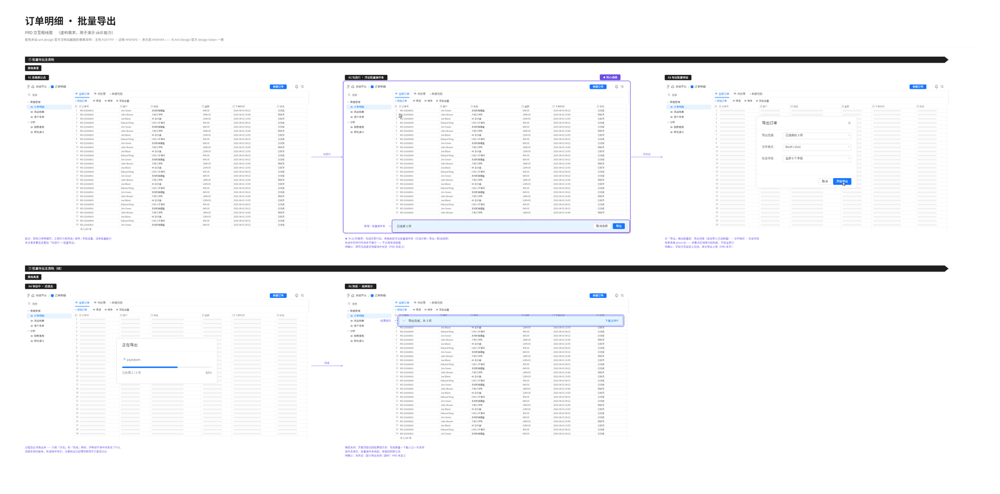
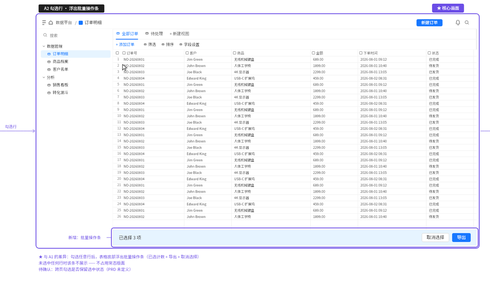
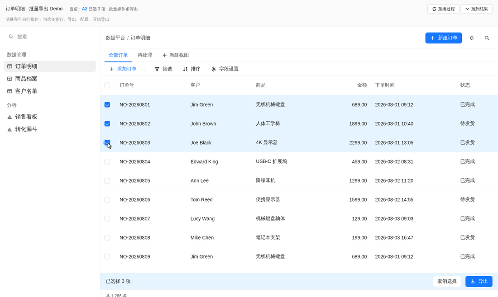
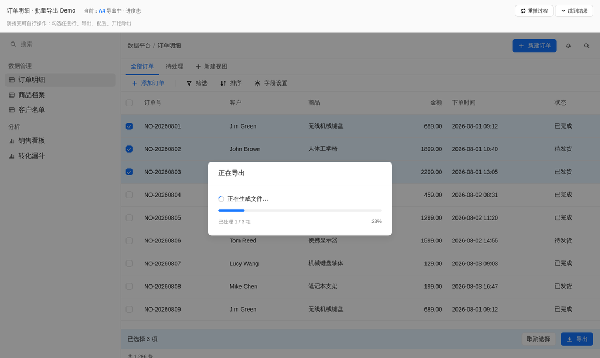
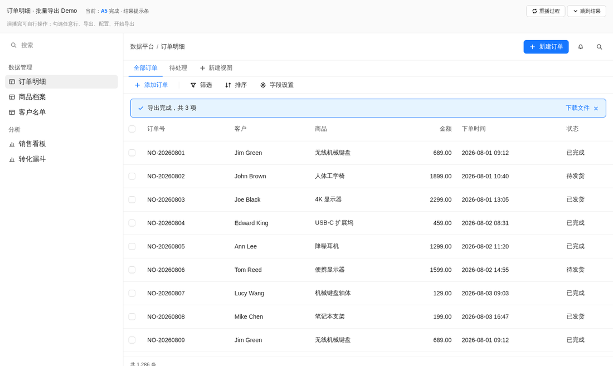

# prd-prototype-demo

**Turn a PRD plus a few product screenshots into frame-by-frame interaction wireframes and a clickable demo that actually looks like your product.**

A [Claude Code](https://claude.com/claude-code) skill built for product managers. One concrete goal: make AI-generated prototypes **stop looking AI-generated**, so you can take them straight into a design review.

[中文](./README.md) · [MIT License](../LICENSE)



> The image above is the actual output: 5 interaction frames, with colors **pixel-sampled**
> from screenshots of the [ant.design](https://ant.design) documentation site.
> The sampled primary `#1677FF`, border `#F0F0F0` and table-header fill `#FAFAFA` match
> Ant Design's official design tokens exactly — a cross-check on sampling accuracy.
> (The feature itself is fictional, for demonstration only.)

---

## The problem

When a PM asks an AI to generate a demo, the output usually screams "a machine made this" — and showing it to designers and engineers backfires.

But you have to diagnose the cause correctly, or you'll fix the wrong thing. **Models are not bad at visual imitation.** Give one a screenshot and it will sample a close-enough primary color and produce a credible table. In head-to-head tests, the unconstrained side scored well on single-shot visual fidelity too.

The real problems are these four, and none of them is about taste:

| # | Cause | Measured evidence |
|---|---|---|
| 1 | **Colors get reinvented every time** | On a second feature for the same product, the unconstrained side reused only 4 token names from the first feature (2 with different values) and invented 28 new colors. Each output looks coherent alone; side by side they are clearly not the same product |
| 2 | **Colors bypass tokens and get hardcoded** | 55 literal color values outside `:root`, including several not in its own token set. A few edit rounds later it drifts back to the model's default palette |
| 3 | **The deliverable doesn't survive sharing** | A multi-file demo works fine for whoever generated it, but the PM drops the main file in a group chat and everyone else sees a blank page |
| 4 | **It draws the spec, not the interface** | A board full of text cards reading "Area A: 4 KPI cards", "new component here". It looks like a diagram but it's really typeset PRD prose — it still can't explain the interaction in a review |

So this skill isn't about teaching the model to imitate. It's about **freezing the design language into a reusable, checkable profile, and guaranteeing that what gets drawn is a real interface and what gets shipped actually opens.**

---

## Two deliverables

| Deliverable | What it is | Who reads it |
|---|---|---|
| **Frame-by-frame wireframes** (SVG) | To-scale reproduction of real screens, laid out in interaction order | The team, to align on the interaction flow |
| **Clickable HTML demo** | Single file, opens on double-click, auto-plays from start to finish | Engineers and designers, to see how it looks and how it moves |

Both share a **UI profile** (so the visuals come from one source) and a **screen list** (so both cover the same set of screens).

### What the wireframes look like



Every frame is a **complete product window**, not a text card reading "Area A: 4 KPI cards". The drafting language (purple emphasis frames, frame tags, annotations, open questions) is kept strictly separate from the product UI — to highlight something you draw a purple frame, you never resize the product's own controls.

### The demo shows the process

Three consecutive screenshots from a single auto-play run:

| Rows selected, bulk bar appears | Export in progress | Done, with a result notice |
|---|---|---|
|  |  |  |

Look at the middle one: **the in-progress state has to be animated**. If you only draw "clicked" and "finished", a reviewer can't tell what happened in between. The top-left shows a live frame indicator (`A2` / `A4` / `A5`) matching the wireframe frame numbers.

---

## Quick start

### Install

```bash
git clone https://github.com/Sharon-xx-Lin/XX-skills.git
# Claude Code user directory (available across projects)
cp -r XX-skills/prd-prototype-demo ~/.claude/skills/
# or per-project
cp -r XX-skills/prd-prototype-demo .claude/skills/
```

Requirements: Python 3.8+, [Pillow](https://pypi.org/project/Pillow/) (sampling), [Playwright](https://playwright.dev/python/) (render verification — optional but strongly recommended).

```bash
pip install Pillow playwright && playwright install chromium
```

Verify the install using the bundled synthetic profile (no screenshots of your own needed):

```bash
cd examples && python3 quickstart.py
```

If `quickstart.svg` comes out, your environment is ready.

### Usage

Just talk to Claude. No commands to memorize:

```
I need wireframes and a demo for this feature.
The PRD is at ./prd.md and there are 3 product screenshots in ./shots/.
```

Claude walks the six-step flow and — **before drawing anything** — hands you a screen list to confirm. That step tends to surface the gaps in your PRD as a side effect.

---

## The flow

```
① Gather (PRD + shots) → ② UI profile → ③ Screen list → ④ Wireframes → ⑤ HTML demo → ⑥ Self-check
                          reusable asset   clarify gate    SVG            single file    mechanical
```

**Step ② is done once and reused forever.** Later features start at ③ — no need to re-upload screenshots.

### ② The UI profile is the core asset

Profiles live in your working directory at `artifacts/ui-profiles/{product}/`, four files:

```
tokens.css       every design variable — the single source of color
components.css   component styles — may only reference tokens, never literal colors
icons.svg        line-icon sprite — a full icon set is how you structurally kill emoji
profile.md       layout skeleton, information density, interaction idioms, sampling confidence
```

Colors **must be pixel-sampled, never eyeballed**. Human eyes are unreliable on near-identical colors, and being slightly off is exactly what breaks the "does it look like us" test:

```bash
python3 scripts/sample_ui.py --image shot.png --list-points   # suggested sample points
python3 scripts/sample_ui.py --image shot.png --auto          # quick palette survey
python3 scripts/sample_ui.py --image shot.png --spec points.json --out t.json
```

Sampling strategy varies by element role, and **the direction flips automatically based on the background** — this is the make-or-break rule for dark themes:

| Role | Strategy |
|---|---|
| `bg` | Mode of the window |
| `text` | Whichever end contrasts most with the background (darkest on light, brightest on dark) |
| `accent` | Highest **chroma** (`max-min`) — **not** HSV saturation |
| `line` | Scanline: cross the border perpendicularly, find the run that contrasts most with the background |

### ⑤ The demo shows the process, not the result

**The easiest step to get wrong — and you won't notice you got it wrong.**

The failure looks like this: you open the demo and see one screen of "the AI already answered" final state. It looks complete, but it's really just one wireframe frame rebuilt as a web page. When a reviewer asks "how does this flow actually unfold?", the demo has no answer.

The root cause is an ambiguity in the word *interactive*: **controls responding to clicks ≠ demonstrating the interaction**. The former is a final state plus event listeners; the latter is a timeline.

The right approach: the demo **auto-plays from the starting state to the end**, with frames matching the screen list.

| What to animate | How |
|---|---|
| User input | Type character by character; the submit button goes from disabled to enabled |
| Submission | Click (ripple optional) → the starting-state content exits |
| Backend work | A spinner reading "processing…" — **the result must not exist yet at this point** |
| Generation | Text streams out with a blinking caret, not one instant paste |
| Result landing | Charts draw along their path; table rows fade in one by one |

Three supporting pieces: a simulated cursor (so you can see *where* it clicked), a frame indicator (matching the wireframe frame numbers), and "replay / skip to result" buttons (nobody wants to wait for animation during a live review).

`assets/demo-skeleton.html` is a ready-made scaffold with the timeline player built in.

---

## Layout

```
SKILL.md                            main six-step doc — this is what Claude reads
├── references/
│   ├── ui-profile-schema.md        field reference for the four profile files
│   ├── whiteboard.md               collaborative-whiteboard limits + safe SVG subset
│   └── frame-by-frame.md           frame-by-frame spec + how to measure proportions + error list
├── scripts/
│   ├── wireframe_kit.py            desktop component library (41 components)
│   ├── mobile_kit.py               mobile component library (14 components + 39 icons)
│   ├── sample_ui.py                pixel sampling, light/dark adaptive
│   ├── check_demo.py               single-file viability + palette compliance
│   ├── check_profile_drift.py      profile drift detection
│   ├── screenshot.py               render verification over file://
│   └── whiteboard_publish.py       SVG validation / preview (+ optional Lark board publish)
└── assets/
    ├── demo-skeleton.html          single-file demo scaffold with timeline player
    ├── frame-generator-skeleton.py runnable wireframe generator scaffold
    ├── tokens-template.css
    ├── components-template.css
    └── icons-base.svg              55 generic line icons

├── examples/                        install verification (synthetic colors, not a real product)
│   ├── quickstart.py                run once to produce a sample wireframe
│   └── ui-profiles/demo-saas-light/ the four profile files
└── docs/images/                     README assets
```

---

## Three mechanical checks

Static checks are cheap and catch most regressions:

```bash
python3 scripts/check_demo.py --html demo.html            # literal colors / emoji / external refs / icon integrity
python3 scripts/check_profile_drift.py --profile <profile> --target demo.html
python3 scripts/screenshot.py --html demo.html --out s.png # loads over file://, exactly how a user opens it
```

`check_profile_drift.py` verifies that same-named tokens keep the same values and that no colors were invented outside the profile — **new colors are the signal to watch**, because that's the mechanism by which palettes drift round after round.

**Render verification is not a formality.** In practice it caught things no static check could: every icon silently missing, a bar chart rendering invisible, and an entire palette silently falling back to the wrong theme because of a Python reference pitfall.

---

## About the Lark whiteboard integration (optional)

The validation and local preview paths in `whiteboard_publish.py` (`--check` / `--dry-run`) **need no online service at all** and run anywhere.

Only "publish to a Lark whiteboard" needs a Lark environment and ByteDance's internal `lark-cli`. **Not having it changes nothing** — the generated SVG can be shared directly, converted to PNG, or imported into Figma / FigJam / Miro / tldraw or any other board that accepts SVG.

PRs adding publishers for other whiteboard products are welcome.

---

## Validation status

Four real features shipped across two very different products:

| Product form | Features | Profile source |
|---|---|---|
| Light-theme B2B desktop (AI sidebar in a spreadsheet-like SaaS) | 3 | internal product screenshots |
| Dark-theme mobile (content aggregation page in a reading app) | 1 | internal product screenshots |
| Light-theme B2B desktop (Ant Design 5) | 1 (the images in this README) | [ant.design](https://ant.design) docs site — **sampled values match official tokens** |

Cross-product validation surfaced and fixed 9 defects, 5 of which were "directional assumption" bugs — no error raised, silently wrong values, only catchable by render verification. That class of bug **only shows up when you switch products**, which is currently this skill's main source of quality.

**Known limits**: validated on 2 products only; light-theme mobile, tablet and responsive web are untested; `use_profile()` handles several token naming conventions, but a product with a very different naming style may still need a round of adjustment on first run.

---

## Not for

- Actually implementing features in code (this is a prototyping tool, not a dev tool)
- Converting design files into production code
- Flowcharts or architecture diagrams unrelated to product UI

---

## License

[MIT](./LICENSE)
